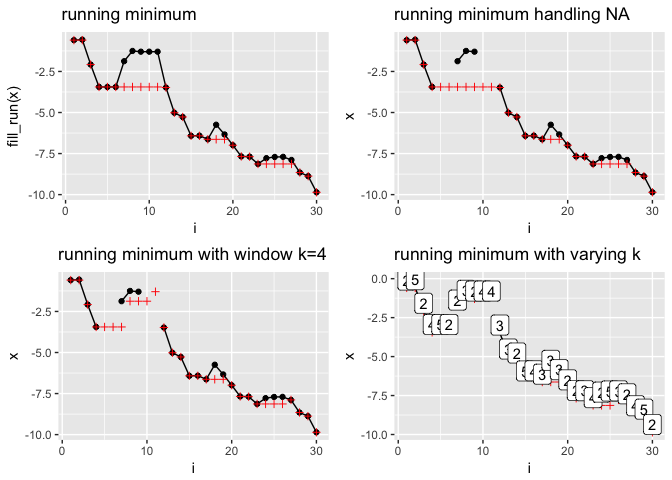

-   [Runner](#runner)
    -   [Installation](#installation)
    -   [Examples](#examples)
        -   [Creating windows](#creating-windows)
        -   [Running aggregations](#running-aggregations)
        -   [Running indexes](#running-indexes)

<!-- README.md is generated from README.Rmd. Please edit that file -->
Runner
======

[](https://travis-ci.org/elo2zero/runner) [](https://opensource.org/licenses/mit-license.php) [](https://codecov.io/github/elo2zero/runner?branch=master)

Running functions for R vector written in Rcpp

Installation
------------

You can install runner from github with:

Examples
--------

The main idea of the package is to provide running operations on R vectors. Running functions are these which are applied to all elements up to actual one. For example implemented already in `base` `cumsum`, `cummin` etc. Functions provided in this package works similar but with extended functionality such as handling `NA` and custom window size. Most functions provided in package are based on the same logic
1. `k` window size denotes number of elements from i-th backwards, where functions are calculated.
(obrazek pokazujący ruchome okno)
2. `na_rm` handling missing equivalent to `na.rm`. In case of running functions, `NA` is replaced with last finite value.
3. `na_pad` if window size exceeds number of available elements, than first `k-1` are filled with `NA`.
4. `which` In case of running index, which value ('first' or 'last')

### Creating windows

Function creates list of windows. Because `runner` doesn't provide limited functionality, one can calculate own running-window-statistics oneself.

``` r
library(runner)
library(magrittr)
set.seed(11)
x1    <- 1:5
k     <- c(1,2,3,3,2)

window_run( x1, k = k )
#> [[1]]
#> [1] 1
#> 
#> [[2]]
#> [1] 1 2
#> 
#> [[3]]
#> [1] 1 2 3
#> 
#> [[4]]
#> [1] 2 3 4
#> 
#> [[5]]
#> [1] 4 5
```

Such windows can be used in further calculations, with any R function.

``` r
window_run( x1, k = k ) %>%
  lapply(sum) %>%
  unlist
#> [1] 1 3 6 9 9
```

### Running aggregations

Runner provides basic aggregation method calculated within running windows. By default missing values are removed before calculations (`na_rm=TRUE`).

``` r
set.seed(11)
x <- rnorm( 30 ) %>% cumsum
x[c(5,6,10,11)] <- NA

k  <- sample( 2:5, 30, replace=TRUE)
```

#### min\_run

``` r
min1 <- min_run(x)
min2 <- min_run(x, k=4)
min3 <- min_run(x, k=k, na_rm = FALSE)
```



\`\`\`

#### max\_run

``` r
max1 <- max_run(x)
max2 <- max_run(x, k=4)
max3 <- max_run(x, k=k, na_rm = FALSE)
```

#### mean\_run

``` r
mean1 <- mean_run(x)
mean2 <- mean_run(x, k=4)
mean3 <- mean_run(x, k=k, na_rm = FALSE)
```

#### sum\_run

``` r
sum1 <- sum_run(x)
sum2 <- sum_run(x, k=4)
sum3 <- sum_run(x, k=k, na_rm = FALSE)
```

### Running indexes
