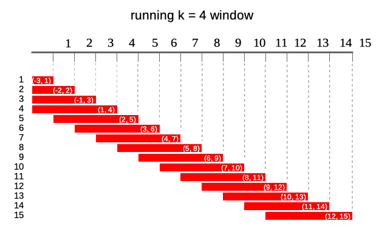
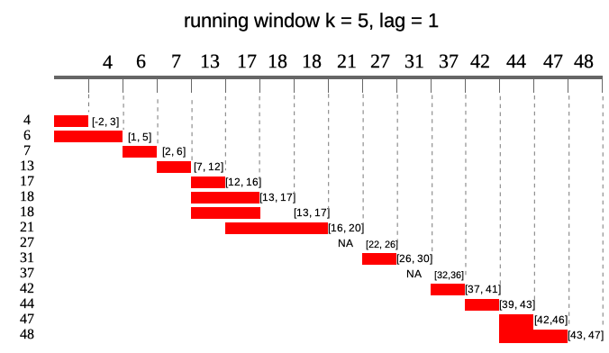
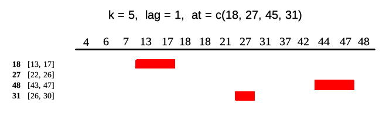

# `runner` an R package for running operations.

# 

<!-- badges: start -->

[](https://CRAN.R-project.org/package=runner)
[](https://travis-ci.org/gogonzo/runner)
[](https://ci.appveyor.com/project/gogonzo/runner)
[](https://codecov.io/gh/gogonzo/runner/branch/master)
<!-- badges: end -->

## About

Package contains standard running functions (aka. rolling) with
additional options like varying window size, lagging, handling missings
and windows depending on date. `runner` brings also rolling streak and
rolling which, what extends beyond range of functions already
implemented in R packages. This package can be successfully used to
manipulate and aggregate time series or longitudinal data.

## Installation

Install package from from GitHub or from CRAN.

``` r
# devtools::install_github("gogonzo/runner")
install.packages("runner")
```

## Using runner

 `runner` package provides functions
applied on running windows. The most universal function is
`runner::runner` which gives user possibility to apply any R function
`f` in running window. R function `f` should return single value for
each window. In example below trimmed mean is calculated on 14-days
window.

``` r
library(runner)
x <- rnorm(20)
dates <- seq.Date(Sys.Date(), Sys.Date() + 19, by = "1 day")

runner(x, 
       k = 14, 
       idx = dates, 
       f = function(xi) {
        mean(xi, na.rm = TRUE, trim = 0.05)
       })
```

## Running windows

All options of the `runner` are explained in each section below using
illustrations and `window_run` function. `window_run` creates list of
running windows with settings which can be used in `runner::runner` and
other functions in the package.

Following diagram illustrates what running windows are - in this case
running windows of length `k = 4`. For each of 15 elements of a vector
each window contains current 4 elements.



### Window size

`k` denotes number of elements in window. If `k` is a single value then
window size is constant for all elements of x. For varying window size
one should specify `k` as integer vector of `length(k) == length(x)`
where each element of `k` defines window length. If `k` is empty it
means that window will be cumulative (like `base::cumsum`). Example
below illustrates window of `k = 4` for 10th element of vector `x`.


``` r
window_run(1:15, k = 4)
```

### Window lag

`lag` denotes how many observations windows will be lagged by. If `lag`
is a single value than it is constant for all elements of x. For varying
lag size one should specify `lag` as integer vector of `length(lag) ==
length(x)` where each element of `lag` defines lag of window. Default
value of `lag = 0`. Example below illustrates window of `k = 4` lagged
by `lag = 2` for 10-th element of vector `x`. Lag can also be negative
value, which shifts window forward instead of backward.


``` r
window_run(1:15, k = 4, lag = 2)
```

### Windows depending on date

Sometimes data points in dataset are not equally spaced (missing
weekends, holidays, other missings) and thus window size should vary to
keep expected time frame. If one specifies `idx` argument, than running
functions are applied on windows depending on date. `idx` should be the
same length as `x` of class `Date` or `integer`. Including `idx` can be
combined with varying window size, than k will denote number of periods
in window different for each data point. Example below illustrates
window of size `k = 5` lagged by `lag = 2`. In parentheses ranges for
each window.



``` r
idx <- c(4, 6, 7, 13, 17, 18, 18, 21, 27, 31, 37, 42, 44, 47, 48)
window_run(x = 1:15, 
           k = 5, 
           lag = 1, 
           idx = idx)
```

### running at

Runner by default returns vector of the same size as `x` unless one puts
any-size vector to `at` argument. Each element of `at` is an index on
which runner calculates function. Below illustrates output of runner for
`at = c(13, 27, 45, 31)` which gives windows in ranges enclosed in
square brackets. Range for `at = 27` is `[22, 26]` which is not
available in current indices.



``` r
idx <- c(4, 6, 7, 13, 17, 18, 18, 21, 27, 31, 37, 42, 44, 47, 48)
window_run(x = idx, 
           k = 5, 
           lag = 1, 
           idx = idx, 
           at = c(18, 27, 48, 31))
```

### `NA` padding

Using `runner` one can also specify `na_pad = TRUE` which would return
`NA` for any window which is partially out of range - meaning that there
is no sufficient number of observations to fill the window. By default
`na_pad = FALSE`, which means that incomplete windows are calculated
anyway. `na_pad` is applied on normal cumulative windows and on windows
depending on date. In example below two windows exceed range given by
`idx` so for these windows are empty for `na_pad = TRUE`. If used sets
`na_pad = FALSE` first window will be empty (no single element within
`[-2, 3]`) and last window will return elements within matching `idx`.


``` r
idx <- c(4, 6, 7, 13, 17, 18, 18, 21, 27, 31, 37, 42, 44, 47, 48)
window_run(x = idx, 
           k = 5, 
           lag = 1, 
           idx = idx, 
           at = c(4, 18, 48, 51),
           na_pad = TRUE)
```

### Build-in functions

With `runner` one can use any R functions, but some of them are
optimized for speed reasons. These functions are:  
\- aggregating functions - `length_run`, `min_run`, `max_run`,
`minmax_run`, `sum_run`, `mean_run`, `streak_run`  
\- utility functions - `fill_run`, `lag_run`, `which_run`
