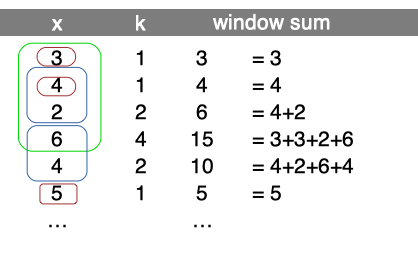
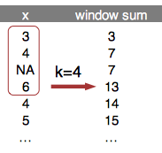
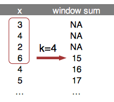

`runner` a R package for running operations.
============================================

sport 
==============================================================

[](https://cran.r-project.org/web/packages/runner/index.html) [](https://travis-ci.org/gogonzo/runner) [](https://ci.appveyor.com/project/gogonzo/runner) 

About
-----

Package contains standard running functions (aka. windowed, rolling, cumulative) with additional options. `runner` provides extended functionality like date windows, handling missings and varying window size. `runner` brings also rolling streak and rollin which, what extends beyond range of functions already implemented in R packages.

Installation
------------

Install package from from github or from CRAN.

``` r
# devtools::install_github("gogonzo/runner")
install.packages("runner")
```

Examples
--------

The main idea of the package is to provide running operations on R vectors. Running functions are these which are applied to all elements up to actual one. For example implemented already in `base` `cumsum`, `cummin` etc. Functions provided in this package works similar but with extended functionality such as handling `NA` and custom window size. The most functions provided in package are based on the same logic:

-   window size `k` denotes number of elements from i-th backwards, where functions are calculated. `k` can be also specified by vector of the same length as x as illustrated in second example.




-   argument `na_rm=T` handling missing and is equivalent to `na.rm`.



-   `na_pad=T` if window size exceeds number of available elements, than first `k-1` elements are filled with `NA`.



-   `which` used with running index, which value ('first' or 'last')


-   `idx` to calculate within time window. `idx` is a date (or numeric) vector of the same length as x. `k` then should to be an integer specyfying time window span. In the example k=5 window sum.


### Creating windows

Function creates list of windows. Because `runner` provide limited functionality, one can create running-window-list which can be further processed by user to obtain desired statistic (eg. window sum). `x` is a vector to be 'run on' and `k` is a length of window. In this example window length is varying as specified by `k`. Provide one value to obtain constant window size.

``` r
library(runner); library(magrittr)
set.seed(11)
window_run( x = 1:5, k = c(1,2,3,3,2) )
#> [[1]]
#> [1] 1
#> 
#> [[2]]
#> [1] 1 2
#> 
#> [[3]]
#> [1] 1 2 3
#> 
#> [[4]]
#> [1] 2 3 4
#> 
#> [[5]]
#> [1] 4 5
```

Such windows can be used in further calculations, with any R function. Example below shows how to obtain running `sum` in specified, varying window length (specified by `k`).

``` r
window_run( x= 1:5, k = c(1,2,3,3,2) ) %>%
  lapply(sum) %>%
  unlist
#> [1] 1 3 6 9 9
```

One can also specify window based on a date of other numeric index. To do this date should be passed via `idx` argument and k should be integer denoting date-window span.

``` r
window_run( x = 1:5, k = 3, idx = c(1,2,5,6,7) ) 
#> [[1]]
#> [1] 1
#> 
#> [[2]]
#> [1] 1 2
#> 
#> [[3]]
#> [1] 3
#> 
#> [[4]]
#> [1] 3 4
#> 
#> [[5]]
#> [1] 3 4 5
```

### Unique elements in window

User can use `unique_run` create list of unique elements within specified window size.

``` r
x2 <- sample( letters[1:3], 6, replace=TRUE)
x2 
#> [1] "a" "a" "b" "a" "a" "c"
unique_run( x=x2, k = 3 )
#> [[1]]
#> [1] "a"
#> 
#> [[2]]
#> [1] "a"
#> 
#> [[3]]
#> [1] "a" "b"
#> 
#> [[4]]
#> [1] "a" "b"
#> 
#> [[5]]
#> [1] "b" "a"
#> 
#> [[6]]
#> [1] "c" "a"
```

### Running aggregations `(mean|sum|min|max)_run`

Runner provides basic aggregation methods calculated within running windows. Below example showing some functions behavior for different arguments setup. Let's take a look at 8th element of a vector on which `min_run` is calculated. First setup uses default values, so algorithm is looking for minimum value in all elements before actual (i=8). By default missing values are removed before calculations by argument `na_rm=TRUE`, and also window is not specified. The default is equivalent of `base::cummin` with additional option to ignore `NA` values. In second example within window k=5, the lowest value is -3. In the last example minimum is not available due to existence of `NA`. Graphical example is reproduced below in the code.


``` r
x <- c(1,-5,1,-3,NA,NA,NA,1,-1,NA,-2,3)
k <- c(4,5,2,5,4,4,2,2,4,4,3,1)
idx <- c(1,3,4,6,7,10,13,16,19,21,23,26)

a0 <- cummin(x)
a1 <- min_run(x, na_rm = TRUE)
a2 <- min_run(x, k=5, na_rm = TRUE)
a3 <- min_run(x, na_rm = FALSE)
a4 <- min_run(x, k=k, na_rm = TRUE, na_pad = TRUE)
a5 <- min_run(x, k=5, idx=idx)


data.frame(idx, x, a0, a1, a2, a3, a4, a5)
#>    idx  x a0 a1 a2 a3 a4  a5
#> 1    1  1  1  1  1  1 NA   1
#> 2    3 -5 -5 -5 -5 -5 NA  -5
#> 3    4  1 -5 -5 -5 -5 NA  -5
#> 4    6 -3 -5 -5 -5 -5 -5  -5
#> 5    7 NA NA -5 -5 NA -5  -5
#> 6   10 NA NA -5 -5 NA -3  -3
#> 7   13 NA NA -5 -3 NA NA Inf
#> 8   16  1 NA -5 -3 NA  1   1
#> 9   19 -1 NA -5 -1 NA -1  -1
#> 10  21 NA NA -5 -1 NA -1  -1
#> 11  23 -2 NA -5 -2 NA -2  -2
#> 12  26  3 NA -5 -2 NA  3  -2
```

### fill\_run

Function used to replace `NA` with previous non-NA element. To understand how `fill_run` works, take a look on illustration. Row 'x' represents, and another rows represent replaced `NA` by fill\_run with different options setup (run\_for\_first=TRUE and only\_within=TRUE respectively). By default, `fill_run` replaces all `NA` if they were preceded by any value. If `NA` appeared in the beginning of the vector then it would not be replaced. But if user specify `run_for_first=TRUE` initial empty values values will be replaced by next non-empty value. Option `only_within=TRUE` means that `NA` values would be replaced if they were surrounded by pair of identical values. No windows provided in this functionality.


``` r
x <- c(NA, NA, "b","b","a",NA,NA,"a","b",NA,"a","b")
data.frame(x, 
           f1 = fill_run(x), 
           f2 = fill_run(x,run_for_first = T), 
           f3 = fill_run(x, only_within = T))
#>       x   f1 f2   f3
#> 1  <NA> <NA>  b <NA>
#> 2  <NA> <NA>  b <NA>
#> 3     b    b  b    b
#> 4     b    b  b    b
#> 5     a    a  a    a
#> 6  <NA>    a  a    a
#> 7  <NA>    a  a    a
#> 8     a    a  a    a
#> 9     b    b  b    b
#> 10 <NA>    b  b <NA>
#> 11    a    a  a    a
#> 12    b    b  b    b
```

### Running streak

To count consecutive elements in specified window one can use `streak_run`. Following figure illustrates how streak is calculated with three different options setup for 9th element of the input vector `x`. First shows default configuration, with full window and `na_rm=T`. Second example count within k=4 window with count reset on `NA`. Last example counting streak with continuation after `NA`. Visualization also supported with corresponding R code.


``` r
x <- c("A","B","A","A","B","B","B",NA,"B","A","B")
data.frame(
  x, 
  s0 = streak_run(x),
  s1 = streak_run(x, na_rm=F, k=3),
  s2 = streak_run(x, k=4) )
#>       x s0 s1 s2
#> 1     A  1  1  1
#> 2     B  1  1  1
#> 3     A  1  1  1
#> 4     A  2  2  2
#> 5     B  1  1  1
#> 6     B  2  2  2
#> 7     B  3  3  3
#> 8  <NA>  3 NA  3
#> 9     B  4  1  3
#> 10    A  1  1  1
#> 11    B  1  1  1
```

### Running which

To obtain index number of element satisfying some condition in window, one can use running which. Functions from this group returns index while condition is `TRUE` appeared before n-th element of a vector. In below example `whicht_run` function returns index of element containing `TRUE` value. If `na_rm=T` is specified, missing is treated as `FALSE`, and is ignored while searching for `TRUE`. While user set `na_rm=F` like in second example, function returns `NA`, because in following window `TRUE` appears after missing and it's impossible to be certain which is first (missing is an element of unknown value - could be TRUE or FALSE).


``` r
x <- c(T,T,T,F,NA,T,F,NA,T,F,T,F)
data.frame(
  x, 
  s0 = whicht_run(x, which="first"),
  s1 = whicht_run(x, na_rm=F, k=5, which="first"),
  s2 = whicht_run(x, k=5,"first"))
#>        x s0 s1 s2
#> 1   TRUE  1  1  1
#> 2   TRUE  1  1  1
#> 3   TRUE  1  1  1
#> 4  FALSE  1  1  1
#> 5     NA  1  1  1
#> 6   TRUE  1  2  2
#> 7  FALSE  1  3  3
#> 8     NA  1 NA  6
#> 9   TRUE  1 NA  6
#> 10 FALSE  1  6  6
#> 11  TRUE  1 NA  9
#> 12 FALSE  1 NA  9
```

Custom indexes
--------------
