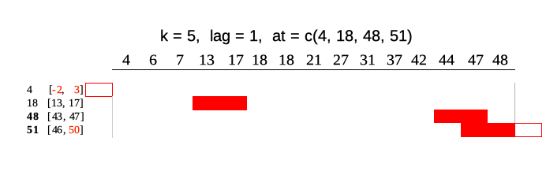

## Using runner

`runner` package provides functions applied on running windows. The most 
universal function is `runner::runner` which gives user possibility to apply 
any R function `f` on running windows. Running windows are defined for each data
window size `k`, `lag` with respect to their indexes. Unlike other available R 
packages, `runner` supports any input and output type and also gives full control
to manipulate window size and lag/lead.

There are different kinds of running windows and all of them are implemented in
`runner`.

### Cumulative windows

The simplest window type which is similar to `base::cumsum`. At each element
window is defined by all elements appearing before current.


In `runner` this can be achieved as simple by:

```{r eval=FALSE}
# full windows
runner(1:15)

# summarizing - sum
runner(
  1:15,
  f = sum
)

# summarizing - concatenating
runner(
  letters[1:15],
  f = paste,
  collapse = " > "
)
```

### Constant sliding windows

Second type of windows are these commonly known as running/rolling/moving/sliding windows. 
This types of windows moves along the index instead of "stretching" like a previous ones.  
Following diagram illustrates running windows of length `k = 4`. Each of 15 windows
contains 4 elements (except first three).


To obtain constant sliding windows one just needs to specify `k` argument 

```{r eval=FALSE}
# summarizing - sum of 4-elements
runner(
  1:15,
  k = 4,
  f = sum
)

# summarizing - slope from lm
runner(
  x = data.frame(
    a = 1:15,
    b = 3 * 1:15 + rnorm(15)
  ),
  k = 5,
  f = function(x) {
    model <- lm(b ~ a, data = x)
    coefficients(model)["a"]
  }
)
```

### Windows depending on date
By default `runner` calculates on assumption that index increment by one, but sometimes 
data points in dataset are not equally spaced (missing weekends, holidays, other missings) 
and thus window size should vary to keep expected time frame. If one specifies 
`idx` argument, than running functions are applied on windows depending on date
rather on a sequence 1-n. 
`idx` should be the same length as `x` and should be of type `Date`, `POSIXt` or `integer`.
Example below illustrates window of size `k = 5` lagged by `lag = 1`. 
Note that one can specify also `k = "5 days"` and `lag = "day"` as in `seq.POSIXt`.
In parentheses ranges for each window.


```{r eval=FALSE}
idx <- c(4, 6, 7, 13, 17, 18, 18, 21, 27, 31, 37, 42, 44, 47, 48)

# summarize - mean
runner::runner(
  x = idx, 
  k = 5, # 5-days window
  lag = 1,
  idx = idx,
  f = function(x) mean(x)
)


# use Date or datetime sequences
runner::runner(
  x = idx, 
  k = "5 days", # 5-days window
  lag = 1,
  idx = Sys.Date() + idx,
  f = function(x) mean(x)
)

# obtain window from above illustration
runner::runner(
  x = idx, 
  k = "5 days",
  lag = 1,
  idx = Sys.Date() + idx
)
```

### running at

Runner by default returns vector of the same size as `x` unless one puts any-size 
vector to `at` argument. Each element of `at` is an index on which runner 
calculates function. Example below illustrates output of runner for `at = c(13, 27, 45, 31)` 
which gives windows in ranges enclosed in square brackets. Range for `at = 27` is
`[22, 26]` which is not available in current indices.  


```{r eval=FALSE}
idx <- c(4, 6, 7, 13, 17, 18, 18, 21, 27, 31, 37, 42, 44, 47, 48)

# summary
runner::runner(x = 1:15, 
               k = 5,
               lag = 1,
               idx = idx,
               at = c(18, 27, 48, 31),
               f = mean)

# full window
runner::runner(x = idx, 
               k = 5,
               lag = 1,
               idx = idx,
               at = c(18, 27, 48, 31))
```

`at` can also be specified as interval of the output defined by time interval 
which results in obtaining results on following indices 
`seq(min(idx), max(idx), by = "<time interval>")`. Interval can be set in the same
way as in `seq.POSIXt` function. It's worth noting that `at` interval shouldn't be
more frequent than interval of `idx` - for `Date` the most frequent interval is a 
`"day"`, for `POSIXt` it's a `"sec"`.

```{r eval=FALSE}
idx_date <- seq(Sys.Date(), Sys.Date() + 365, by = "1 month")

# change interval to 4-months
runner(
  x = 0:12,
  idx = idx_date,
  at = "4 months"
)

# calculate correlation at every 6-months
runner(
  x = data.frame(
    a = 1:13,
    b = 1:13 + rnorm(13, sd = 5)
  ),
  idx = idx_date,
  at = "6 months",
  f = function(x) {
    cor(x$a, x$b)
  }
)
```

### Move and stretch window in time

One can stretch window length by `k` and shift in time (or index) using `lag`.
Both arguments can be `integer` and also time interval like for example `2 months`.
If `k` or `lag` are a single value then window size/lag are constant for all 
elements of x. User can also specify `k/lag` as vector, then size and
lag will vary for each window. 
Both `k` and `lag` can be of `length(.) == 1`, `length(.) == length(x)` or 
`length(.) == length(at)` (if `at` is specified).
`lag` can be negative and positive while `k` only non-negative. 

```{r eval=FALSE}
# summarizing - concatenating
runner::runner(
  x = 1:10, 
  lag = c(-1, 2, -1, -2, 0, 0, 5, -5, -2, -3), 
  k = c(0, 1, 1, 1, 1, 5, 5, 5, 5, 5), 
  f = paste,
  collapse = ","
)

# full window
runner::runner(
  x = 1:10, 
  lag = 1,
  k = c(1, 1, 1, 1, 1, 5, 5, 5, 5, 5)
)

# on dates
idx <- c(4, 6, 7, 13, 17, 18, 18, 21, 27, 31, 37, 42, 44, 47, 48)

runner::runner(
  x = 1:15, 
  lag = sample(c("-2 days", "-1 days", "1 days", "2 days"), 
               size = 15, 
               replace = TRUE),
  k = sample(c("5 days", "10 days", "15 days"), 
             size = 15, 
             replace = TRUE),
  idx = Sys.Date() + idx,
  f = function(x) mean(x)
)
```

### `NA` padding  
Using `runner` one can also specify `na_pad = TRUE` which would return `NA` for 
any window which is partially out of range - meaning that there is no sufficient 
number of observations to fill the window. By default `na_pad = FALSE`, which 
means that incomplete windows are calculated anyway. `na_pad` is applied on 
normal cumulative windows and on windows depending on date. In example below two
windows exceed range given by `idx` so for these windows are empty for 
`na_pad = TRUE`. If used sets `na_pad = FALSE` first window will be empty 
(no single element within `[-2, 3]`) and last window will return elements within
matching `idx`.



```{r eval=FALSE}
idx <- c(4, 6, 7, 13, 17, 18, 18, 21, 27, 31, 37, 42, 44, 47, 48)
runner::runner(x = 1:15, 
               k = 5, 
               lag = 1, 
               idx = idx, 
               at = c(4, 18, 48, 51),
               na_pad = TRUE,
               f = function(x) mean(x))
```

### Build-in functions
With `runner` one can use any R functions, but some of them are optimized for 
speed reasons.
These functions are:  
- aggregating functions - `length_run`, `min_run`, `max_run`, `minmax_run`,
`sum_run`, `mean_run`, `streak_run`  
- utility functions - `fill_run`, `lag_run`, `which_run`
