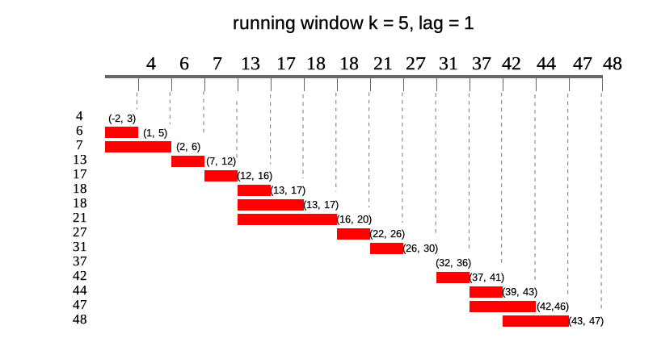

## Using runner

`runner` package provides functions applied on running windows. The most 
universal function is `runner::runner` which gives user possibility to apply 
any R function `f` in running window. R function `f` should return single value 
for each window. In example below trimmed mean is calculated on 14-days window.

```{r eval=FALSE}
library(runner)
x <- rnorm(20)
dates <- seq.Date(Sys.Date(), Sys.Date() + 19, by = "1 day")

runner(x, 
       k = 14, 
       idx = dates, 
       f = function(xi) {
        mean(xi, na.rm = TRUE, trim = 0.05)
       })
```

## Running windows
All options of the `runner` are explained in each section below using 
illustrations and `window_run` function. `window_run` creates list of running 
windows with settings which can be used in `runner::runner` and other functions 
in the package.  

Following diagram illustrates what running windows are - in this case running 
windows of length `k = 4`. For each of 15 elements of a vector each window 
contains current 4 elements.


### Window size
`k` denotes number of elements in window. If `k` is a single value then window 
size is constant for all elements of x. For varying window size one should specify 
`k` as integer vector of `length(k) == length(x)` where each element of `k` 
defines window length. If `k` is empty it means that window will be cumulative 
(like `base::cumsum`). Example below illustrates window of `k = 4` for 10th 
element of vector `x`.  


```{r eval=FALSE}
runner::runner(x = 1:15, 
               k = 4, 
               f = function(x) mean(x))
```

### Window lag
`lag` denotes how many observations windows will be lagged by. If `lag` is a 
single value than it is constant for all elements of x. For varying lag size one 
should specify `lag` as integer vector of `length(lag) == length(x)` where each 
element of `lag` defines lag of window. Default value of `lag = 0`. Example 
below illustrates window of `k = 4` lagged by `lag = 2` for 10'th element of 
vector `x`. Lag can also be negative value, which shifts window forward instead 
of backward.


```{r eval=FALSE}
runner::runner(x = 1:15, 
               k = 4, 
               lag = 2,
               f = function(x) mean(x))
```

### Windows depending on date
Sometimes data points in dataset are not equally spaced (missing weekends, 
holidays, other missings) and thus window size should vary to keep expected time
frame.  If one specifies `idx` argument, than running functions are applied on 
windows depending on date. `idx` should be the same length as `x` of class `Date` 
or `integer`. Including `idx` can be combined with varying window size, than k
will denote number of periods in window different for each data point. Example
below illustrates window of size `k = 5` lagged by `lag = 2`. In parentheses 
ranges for each window.



```{r eval=FALSE}
idx <- c(4, 6, 7, 13, 17, 18, 18, 21, 27, 31, 37, 42, 44, 47, 48)
runner::runner(x = 1:15, 
               k = 5,
               lag = 1,
               idx = idx,
               f = function(x) mean(x))
```

### running at

Runner by default returns vector of the same size as `x` unless one puts any-size 
vector to `at` argument. Each element of `at` is an index on which runner 
calculates function. Below illustrates output of runner for `at = c(13, 27, 45, 31)` 
which gives windows in ranges enclosed in square brackets. Range for `at = 27` is
`[22, 26]` which is not available in current indices.  


```{r eval=FALSE}
idx <- c(4, 6, 7, 13, 17, 18, 18, 21, 27, 31, 37, 42, 44, 47, 48)
runner::runner(x = 1:15, 
               k = 5,
               lag = 1,
               idx = idx,
               at = c(18, 27, 48, 31),
               f = function(x) mean(x))
```


### `NA` padding  
Using `runner` one can also specify `na_pad = TRUE` which would return `NA` for 
any window which is partially out of range - meaning that there is no sufficient 
number of observations to fill the window. By default `na_pad = FALSE`, which 
means that incomplete windows are calculated anyway. `na_pad` is applied on 
normal cumulative windows and on windows depending on date. In example below two
windows exceed range given by `idx` so for these windows are empty for 
`na_pad = TRUE`. If used sets `na_pad = FALSE` first window will be empty 
(no single element within `[-2, 3]`) and last window will return elements within
matching `idx`.


```{r eval=FALSE}
idx <- c(4, 6, 7, 13, 17, 18, 18, 21, 27, 31, 37, 42, 44, 47, 48)
runner::runner(x = 1:15, 
               k = 5, 
               lag = 1, 
               idx = idx, 
               at = c(4, 18, 48, 51),
               na_pad = TRUE,
               f = function(x) mean(x))
```

### Build-in functions
With `runner` one can use any R functions, but some of them are optimized for 
speed reasons.
These functions are:  
- aggregating functions - `length_run`, `min_run`, `max_run`, `minmax_run`,
`sum_run`, `mean_run`, `streak_run`  
- utility functions - `fill_run`, `lag_run`, `which_run`
