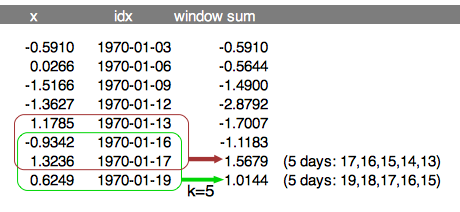
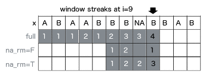
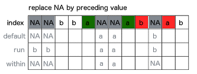
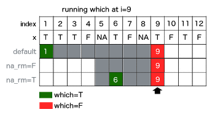

This tutorial presents built-in functions in runner package which goal is to 
maximize performance. Even if one can apply any R function with `runner::runner`,
built-in functions are multiple times faster than R equivalent. Before you 
proceed further to this tutorial, make sure you know what the
["running functions are"](../index.html).

## Running aggregations

### Running `<mean,sum,min,max>_run`

Runner provides basic aggregation methods calculated within running windows. 
Below example showing some functions behavior for different arguments setup. 
`min_run` calculates current minimum for all elements of the vector. Let's take 
a look at 8'th element of the vector which `min_run` is calculated on.  
First setup uses default values, so algorithm is looking for minimum value in 
all elements before actual (i=8). By default missing values are removed before 
calculations by argument `na_rm = TRUE`, and also window is not specified. The 
default is equivalent of `base::cummin` with additional option to ignore `NA` 
values. In second example within window k=5, the lowest value is -3. In the last 
example minimum is not available due to existence of `NA`. Graphical example is 
reproduced below in the code.


```{r min_run_example, echo=TRUE}
library(runner)
x <- c(1, -5, 1, -3, NA, NA, NA, 1, -1, NA, -2, 3)

data.frame(
  x,
  default = min_run(x, na_rm = TRUE), 
  k_5     = min_run(x, k = 5, na_rm = TRUE),
  narm_f  = min_run(x, na_rm = FALSE))
```

In above example constant `k = 5` has been used which means that for each element, 
current minimum is calculated on last 5-elements. It may happen that one can have
time series where elements are not equally spaced in time, which effects in `k = 5`
not constant. In example below 5-days sum is calculated. To achieve this, one should
put date variable to `idx` argument.  
Illustration below shows two sums calculated in 5-days window span. In both cases
5-days fit in 3-elements windows. Equivalent R code below.



```{r idx_run_example, echo=TRUE}
x <- c(-0.5910, 0.0266, -1.5166, -1.3627, 1.1785, -0.9342, 1.3236, 0.6249)
idx <- as.Date(c("1970-01-03", "1970-01-06", "1970-01-09", "1970-01-12", 
                 "1970-01-13", "1970-01-16", "1970-01-17", "1970-01-19"))

sum_run(x, k = 5, idx = idx)
```

Specifying `lag` argument shift of the window by number of elements or time periods
(if `idx` is specified). 

```{r lag_run_example, echo=TRUE}
x <- c(-0.5910, 0.0266, -1.5166, -1.3627, 1.1785, -0.9342, 1.3236, 0.6249)
idx <- as.Date(c("1970-01-03", "1970-01-06", "1970-01-09", "1970-01-12", 
                 "1970-01-13", "1970-01-16", "1970-01-17", "1970-01-19"))

sum_run(x, k = 5, lag = 2, idx = idx)
```


### Running streak

To count consecutive elements in specified window one can use `streak_run`. Following 
figure illustrates how streak is calculated with three different options setup for
9th element of the input vector `x`. First shows default configuration, with full
window and `na_rm = TRUE`. Second example count within `k = 4` window with count
reset on `NA`. Last example counting streak with continuation after `NA`. 
Visualization also supported with corresponding R code.



```{r}
x <- c("A", "B", "A", "A", "B", "B", "B", NA, "B", "B", "A", "B")
data.frame(
  x, 
  s0 = streak_run(x),
  s1 = streak_run(x, k = 4, na_rm = FALSE),
  s2 = streak_run(x, k = 4))
```

Streak is often used in sports to count number of wins or loses of the team/player.
To count consecutive wins or loses in 5-days period, one have to specify `k = 5` 
and include dates into `idx` argument. Specifying `lag` shifts window bounds by 
number of elements or time periods (if `idx` is specified).

```{r}
x <- c("W", "W", "L", "L", "L", "W", "L", "L")
idx <- as.Date(c("2019-01-03", "2019-01-06", "2019-01-09", "2019-01-12", 
                 "2019-01-13", "2019-01-16", "2019-01-17", "2019-01-19"))

data.frame(
  idx,
  x,
  streak_5d     = streak_run(x, k = 5, idx = idx),
  streak_5d_lag = streak_run(x, k = 5, lag = 1, idx = idx))
```

## Utility functions

### Improved lag

Idea of `lag_run` is the same as well known `stats::lag`, with distinction that
`lag_run` can depend on time or any other indexes passed to `idx` argument. 
This means that `lag_run` can shift by `lag` elements of the vector or by `lag` 
time periods (if `idx` is specified).  

```{r}
x <- c(-0.5910, 0.0266, -1.5166, -1.3627, 1.1785, -0.9342, 1.3236, 0.6249)
idx <- as.Date(c("1970-01-03", "1970-01-06", "1970-01-09", "1970-01-12", 
                 "1970-01-13", "1970-01-16", "1970-01-17", "1970-01-19"))

lag_run(x, lag = 3, idx = idx)
```

### Filling missing values

Function used to replace `NA` with previous non-NA element. To understand how 
`fill_run` works, take a look on illustration. Row 'x' represents input, and
another rows represent output with `NA` replaced by `fill_run` with different 
options setup (`run_for_first = TRUE` and `only_within = TRUE` respectively). 
By default, `fill_run` replaces all `NA` if they were preceded by any value. If 
`NA` appeared in the beginning of the vector then it would not be replaced. But 
if user specify `run_for_first = TRUE` initial empty values values will be 
replaced by next non-empty value. Option `only_within = TRUE` means that `NA` 
values would be replaced if they were surrounded by pair of identical values. No 
windows provided in this functionality.



```{r}
x <- c(NA, NA, "b", "b", "a", NA, NA, "a", "b", NA, "a", "b")
data.frame(x, 
           f1 = fill_run(x), 
           f2 = fill_run(x,run_for_first = TRUE), 
           f3 = fill_run(x, only_within = TRUE))
```

### Running which  

To obtain index number of element matching some condition in window, one can use 
`which_run`, which returns index of  `TRUE` element appeared before n-th element 
of a vector. If `na_rm = TRUE` is specified, missing is treated as `FALSE`, and
is ignored while searching for `TRUE`. While user set `na_rm = FALSE` like in
second example, function returns `NA`, because in following window `TRUE` appears
after missing and it's impossible to be certain which is first (missing is an
element of unknown value - could be `TRUE` or `FALSE`).




```{r}
x <- c(T, T, T, F, NA, T, F, NA, T, F, T, F)
data.frame(
  x, 
  s0 = which_run(x, which = "first"),
  s1 = which_run(x, na_rm = FALSE, k = 5, which = "first"),
  s2 = which_run(x, k = 5, which = "last"))

```


`which` argument ('first' or 'last') used with `which_run` determines which index
of matching element should be returned from window. In below illustration in 
`k = 4` elements window there are two `TRUE` values, and depending on `which`
argument output is equal `2`  or `4`. 


