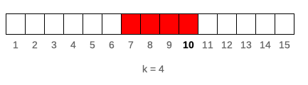
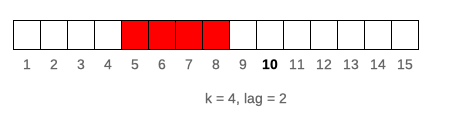
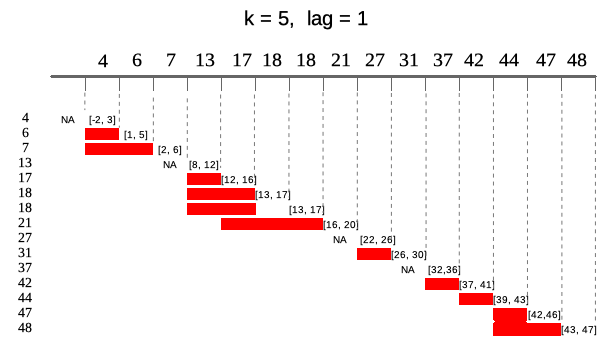
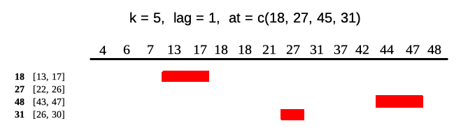

## Overview

`runner` applies any R function on running (rolling/sliding) windows. It gives
full control over window size (`k`), lag, and time-based indexing (`idx`), and
supports vectors, data frames, and matrices as input. It also integrates with
`dplyr::group_by`.

Below, a 4-month rolling correlation is computed with a 1-month lag:

```{r eval=FALSE}
library(runner)

x <- data.frame(
  date = seq.Date(Sys.Date(), Sys.Date() + 365, length.out = 20),
  a = rnorm(20),
  b = rnorm(20)
)

runner(x, lag = "1 months", k = "4 months", idx = x$date,
       f = function(x) cor(x$a, x$b))
```

## Window types

### Sliding window (`k`)

`k` sets the number of elements in each window. When `k` is a single constant,
the window slides along the data with a fixed size. If `k` is omitted, windows
are cumulative — each window grows from the first element to the current one.



```{r eval=FALSE}
# 4-element sliding sum
runner(1:15, k = 4, f = sum)

# cumulative sum (k omitted)
runner(1:15, f = sum)
```

`k` can also be a vector of `length(x)` to use a different window size at each
position.

### Lag (`lag`)

`lag` shifts the window backward (positive values) or forward (negative values)
relative to the current element. Default is `lag = 0`. Like `k`, `lag` can be
a single value or a vector of `length(x)`.



```{r eval=FALSE}
runner(1:15, k = 4, lag = 2, f = sum)
```

### Index-based windows (`idx`)

By default, `runner` treats elements as equally spaced (index increments by 1).
Real data often has gaps — missing weekends, holidays, irregular timestamps.
Setting `idx` makes `k` and `lag` refer to index distance instead of element
count, so the number of elements per window varies with the spacing.

For example, a 5-day window (`k = 5`) on unevenly-spaced dates will contain
different numbers of observations at each step:



`k` and `lag` also accept time-interval strings using the same syntax as
`seq.POSIXt(by = ...)`, e.g. `"5 days"`, `"2 weeks"`, `"month"`.

```{r eval=FALSE}
idx <- c(4, 6, 7, 13, 17, 18, 18, 21, 27, 31, 37, 42, 44, 47, 48)
runner(idx, k = 5, lag = 1, idx = idx, f = mean)

# equivalent with Date index
runner(idx, k = "5 days", lag = "day", idx = Sys.Date() + idx, f = mean)
```

### Evaluation at specific points (`at`)

By default, `runner` returns one result per element of `x`. Setting `at`
restricts evaluation to specific index positions — the output length equals
`length(at)`. This is useful when you only need results at certain dates or
milestones, not at every observation.



```{r eval=FALSE}
runner(1:15, k = 5, lag = 1, idx = idx, at = c(18, 27, 48, 31), f = mean)
```

`at` can also be a single time-interval string, which generates a regular
sequence over the `idx` range. For example, `at = "4 months"` evaluates at
every 4-month interval from `min(idx)` to `max(idx)`.
