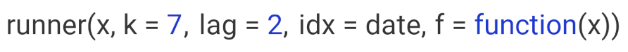

## About
Package contains running functions (rolling or sliding window) with additional options. `runner` provides extended functionality like varying windows size, windows dependent on date, handling missing value. `runner` brings also other utility functions like filling missing values, rolling streak and rollin which.

## Installation

Install package from from github or from CRAN.

```{r gh-installation, eval=FALSE}
# devtools::install_github("gogonzo/runner")
install.packages("runner")
```

## Running windows
`runner` functionality revolves around time series and running windows. Diagram below illustrates what running windows are - in this case running `k = 4` windows. For each of 15 elements of a vector each window contains current 4 elements (exception are first k - 1 elements where window is not complete).


Windows are defined by several parameters, like size, lag and indexes of observation (or date).

### Window size
`k` denotes number of elements in window. If `k` is a single value then window size is constant for all elements of x. For varying window size one should specify `k` as integer vector of `length(k) == length(x)` where each element of `k` defines window length. If `k` is empty it means that window will be cumulative (like `base::cumsum`). Example below illustrates window of `k = 4` for 10'th element of vector `x`.


### Window lag
`lag` denotes how many observations windows will be lagged by. If `lag` is a single value than it's constant for all elements of x. For varying lag size one should specify `lag` as integer vector of `length(lag) == length(x)` where each element of `lag` defines lag of window. Default value of `lag = 0`. Example below illustrates window of `k = 4` lagged by `lag = 2` for 10'th element of vector `x`. Lag can also be negative value, which shifts window forward instead of backward.


### Windows depending on date

Sometimes data points in dataset are not equally spaced (missing weeekends, holidays, other missings) and thus window size should vary to keep expected time frame.  If one specifies `idx` argument, than running functions are applied on windows depending on time. `idx` should be the same length as `x` of class `integer` (or `Date`, `POSIXlt` etc.). Including `idx` can be combined with varying window size, than k will denote number of periods in window different for each data point. Example below illustrates window of size `k = 4` lagged by `lag = 2` periods for 10'th element of vector `x`. This (10th) element has `idx = 13` which means that window ranges `[8, 11]` - although `k = 4` only two elements of `x` are within this window. 


  
### `NA` padding  
Using `runner` one can also specify `na_pad = TRUE` which would return `NA` for any window which 
is partialy out of range - meaning that there is no sufficient number of observations to fill the window. By default `na_pad = FALSE`, which means that incomplete windows are calculated anyway. `na_pad` is applied on normal cumulative windows and on windows depending on date.

## Using package

### Any R function with `runner`

Package contains most fundamental function `runner::runner` which gives possibility to apply any R function `f` on running window. `runner::runner` serve as `sapply` on running windows. Only `x` value needs to be specified while `k`, `lag` and `idx` are optional.
  


Below example of using `base::mean` inside of the `runner` function.
```{r, echo=TRUE}
library(runner)
x <- runif(15)
k <- sample(1:15, 15, replace = TRUE)
idx <- cumsum(sample(c(1, 2, 3, 4), 15, replace = TRUE))

# simple call
simple_mean <- runner(x = x, k = 4, f = mean)

# additional arguments for mean
trimmed_mean <- runner(x = x, k = 4, f = function(x) mean(x, trim = 0.05))

# varying window size
varying_window <- runner(x = x, k = k, f = function(x) mean(x, trim = 0.05))

# windows depending on date
date_windows <- runner(x = x, k = k, idx = idx, f = function(x) mean(x, trim = 0.05))

data.frame(x, k, idx, simple_mean, trimmed_mean, varying_window, date_windows)
```

### builtin functions
With `runner` one can use any R functions, but some of them are optimized for speed reasons.
These functions are:  
- aggregating functions - `length_run`, `min_run`, `max_run`, `minmax_run`, `sum_run`, `mean_run`, `streak_run`  
- utility functions - `fill_run`, `lag_run`, `which_run`

More details about using [built-in functions](built-in_functions.html).


